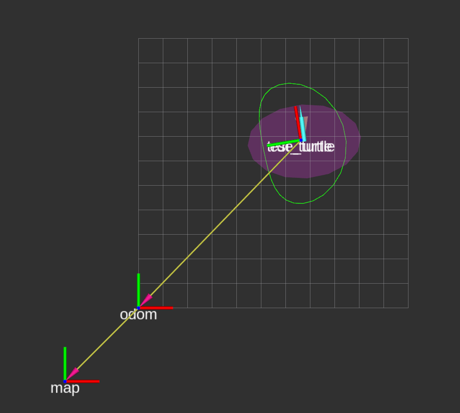
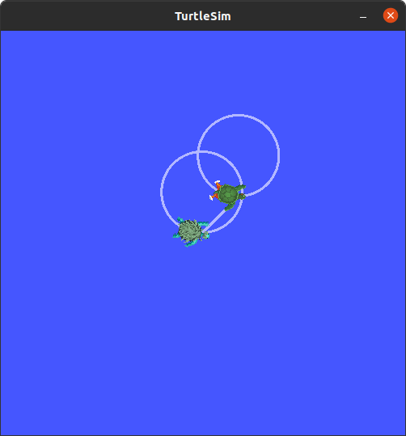
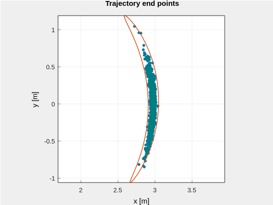

[](https://codecov.io/gh/aalbaali/turtle_nav_cpp)

- [In this repo](#in-this-repo)
- [Nodes](#nodes)
- [Running the dead-reckoning filter](#running-the-dead-reckoning-filter)
  - [Moving turtle using teleop](#moving-turtle-using-teleop)
- [Bag files](#bag-files)
  - [Recording bag files](#recording-bag-files)
  - [Playing back files](#playing-back-files)
  - [Play back script](#play-back-script)
- [Setting parameters](#setting-parameters)
- [Testing](#testing)
- [Pre-commits](#pre-commits)
- [Examples](#examples)

**!! Note !!** This repo is no longer maintained.
It was used as a playground for learning ROS2 and implementing navigation algorithms.

# In this repo
This repository is used as a playground to learn ROS tools and concepts including RVIZ, TF2, etc.
The simulator implements a dead-reckoning estimator and publishes uncertainty bounds using *SE(2)* kinematics.

# Nodes
The nodes are documented in the wiki of the repository.

# Running the dead-reckoning filter
- Start the launch file by running
```bash
ros2 launch turtle_nav_cpp turtle_nav_filter.launch.py
```
- Start the dead-reckoning estimator by setting the pose:
  - From the launched RVIZ window, set a pose by clicking on the **2D Pose Estimate** button on the top of the screen.
  - Choose an appropriate pose estimate to kick-off the dead-reckoning estimator with (note: without this step, the estimator will not start)
- To move the robot around, run a [teleop session](#moving-turtle-using-teleop)
- A screenshot of RVIZ and turtlesim windows are presented in the [images below](#dead_reckoning_rviz)
## Moving turtle using teleop
Starting teleop using
```bash
ros2 run turtlesim turtle_teleop
```
publishes to `/turtle1/cmd_vel` by default.
However, in this package, velocities are published/subscribed from different topics such as `/turtle_true/cmd_vel`.
It's possible to publish teleop to a different topic by remapping the topics.
```bash
ros2 run turtlesim turtle_teleop_key --ros-args --remap /turtle1/cmd_vel:=/true_turtle/cmd_vel
```
To run the turtle in a circle, publish a twist message at a constant rate, which can be done [as follows](https://docs.ros.org/en/foxy/Tutorials/Topics/Understanding-ROS2-Topics.html#:~:text=So%2C%20to%20get%20the%20turtle%20to%20keep%20moving%2C%20you%20can%20run%3A)
```bash
ros2 topic pub --rate 50 /true_turtle/cmd_vel geometry_msgs/msg/Twist "{linear: {x: 2.0, y: 0.0, z: 0.0}, angular: {x: 0.0, y: 0.0, z: 1.8}}"
```

RVIZ output             |  Turtlesim output
:-------------------------:|:-------------------------:
  |  
The green polygon in the image above is the 99% uncertainty bound mapped to the *SE(2)* group, whereas the magenta ellipse is the 99% uncertainty bound in the *se(2)* *Lie algebra*.| Turtleisim view (there's an intentional offset between the two turtles).

# Bag files
Bag files can be used to record messages published on certain topics.
This can be used as a "testing playground" for replicating test scenarios.
For example, it would be possible to record the messages published on the wheel encoder measurements topic `meas/wheel_encoder`.
Then, the same bag data can be "replayed" by playing back the bag, and the *estimator node* is then run on the *same* measurements that were recorded earlier.
This allows testing different estimators on the *same* data.
## Recording bag files
To record messages on *all* topics, run
```bash
ros2 bag record -o <bag-name> -a
```
Recording messages on *all* topics is not always a good idea.
For example, for testing the dead-reckoning code, we'd like to record the "environment" or simulated data.
These are basically the `/initialpose` set in RVIZ, and the measurements `/meas/wheel_encoder`.
These two data points are sufficient to start the dead-reckoning code.
However, we may also need the `/true_pose/cmd_vel` and `/true_pose/pose` as ground truth data for comparison with the estimated data.
Therefore, to record only these topics, run
```bash
ros2 bag record /initialpose /meas/position /meas/wheel_encoder /true_turtle/cmd_vel /true_turtle/pose
```
Note that playing back the bag file with recorded `/initialpose` will overwrite the initial pose recorded by the bag.
Furthermore, the `/true_turtle/pose` may be irrelevant if the pose was changed outside the playback file. Instead, relying on `/true_turtle/cmd_vel` should be sufficient.
Thus, it may be best to record the following topics
```bash
ros2 bag record /meas/position /meas/wheel_encoder /true_turtle/cmd_vel
```
## Playing back files
The command is simple:
```bash
ros2 bag play <bag-file>
```

The dead-reckoning estimator can be run on bag files recorded using the last command in [the last section](#recording-bag-files) as follows:
1. Start the `turtle_nav_filter` launch file using
```bash
ros2 launch turtle_nav_cpp turtle_nav_filter.launch.py
```
2. Set the initial pose on RVIZ. This the dead-reckoning estimation
3. Playback the recorded bag
```bash
ros2 bag play <bag-name>
```
Note that if the initial pose is not set, then only the true pose will be updated, but not the estimated pose (there may not even be an estimated node/ellipse).

## Play back script
A playback script is provided in the `script/` directory to start the launch file and play a bag file (after waiting for few seconds).
For example, from the root directory
```bash
./scripts/play_back.py -b ./bags/circle_50Hz_rosbag2_2022_04_14-00_52_30/rosbag2_2022_04_14-00_52_30_0.db3 -w 5
```


# Setting parameters
```bash
ros2 run <package-name> <node-name> --ros-args -p <param_name>:=<param_value>
```

# Testing
The unit tests can be run using [colcon_test_tools](https://github.com/aalbaali/colcon_test_tools).

# Pre-commits
To use:
```bash
pre-commit run -a
```
Or:
```bash
pre-commit install  # (runs every time you commit in git)
```
To update the `.pre-commit-config.yaml` file:
```bash
pre-commit autoupdate
```
Check [pre-commit](https://pre-commit.com/) for further details on `pre-commit`.

# Examples
The `examples` directory includes stand-alone examples that are not necessarily directly related to the package.
For example, it may have examples about propagating uncertainties.
To build the examples, pass `-DBUILD_EXAMPLES=ON` as a CMake argument.

The image below is the output of the *SE(2) dead-reckoning* example, where the "banana curve" is the 99% uncertainty bounds.
<p align="center">
  
</p>

# FAQs and resolved issues
## Eigen headers not found using `colcon` build
Link the Eigen library to the targets using `target_link_libraries`.
Using `ament_target_dependencies` alone is not sufficient.

## ROS custom message headers not found during build
Add the custom messages to an "interface" using `rosidl_generate_interfaces` and then link them to
the specific target using `rosidl_get_typesupport_target`.
For example,
```cmake
set(msg_files
  "msg/Vector3WithCovariance.msg"
  "msg/Vector3WithCovarianceStamped.msg"
)
rosidl_generate_interfaces(${PROJECT_NAME}
  ${msg_files}
  DEPENDENCIES std_msgs geometry_msgs
  ADD_LINTER_TESTS
)


rosidl_get_typesupport_target(cpp_typesupport_target ${PROJECT_NAME} "rosidl_typesupport_cpp")
rosidl_get_typesupport_target(position_sensor ${PROJECT_NAME} "rosidl_typesupport_cpp")
```
Check [this answer](https://robotics.stackexchange.com/a/23180/29007) for more information.

**Note** that this change is applicable since ROS Humble.

## `colcon` and `ros2` autocomplete not working in `zsh
[This answer](https://github.com/ros2/ros2cli/issues/534#issuecomment-957516107) resolved the issue.
But the autocomplete is somewhat slow, so it's not an ideal solution.

## Some changes from Foxy to Humble
- [Linking custom messages](#ros-custom-message-headers-not-found-during-build)
- `rosidl_target_interfaces` is replaced with `rosidl_get_typesupport_target`
